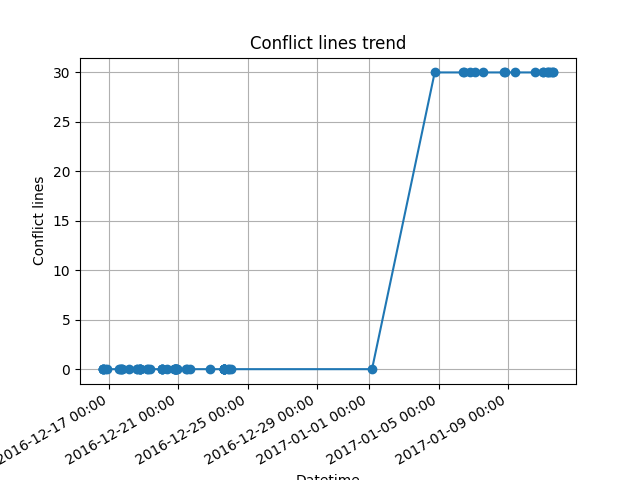
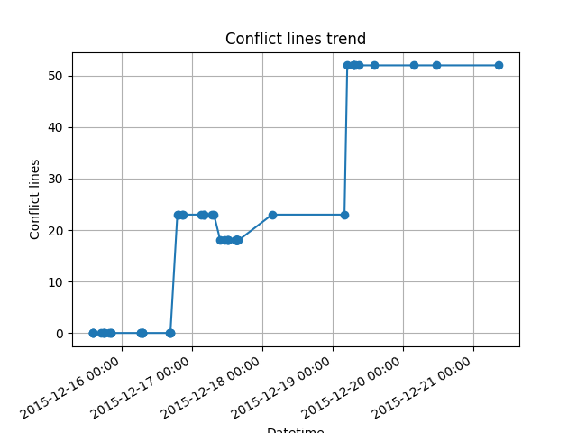
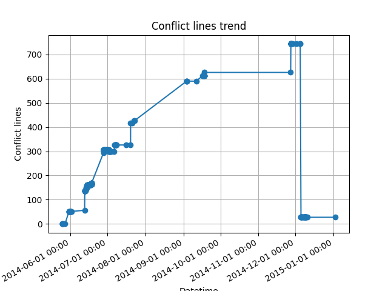
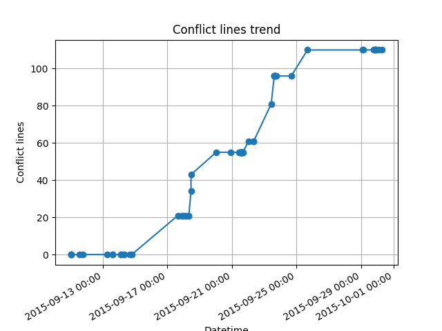
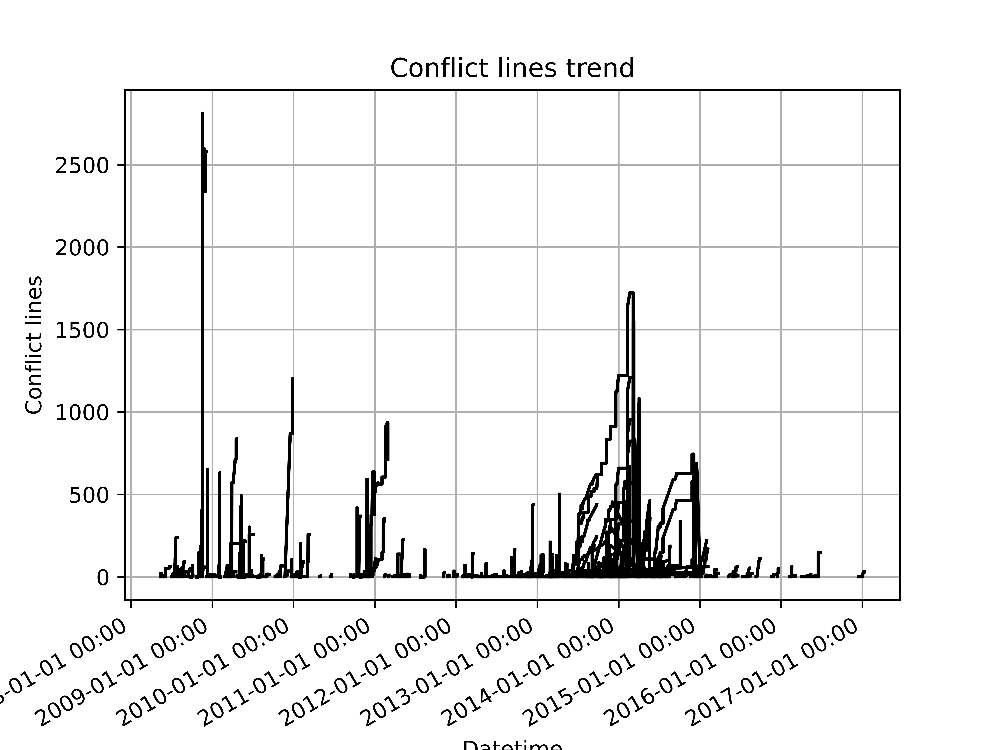
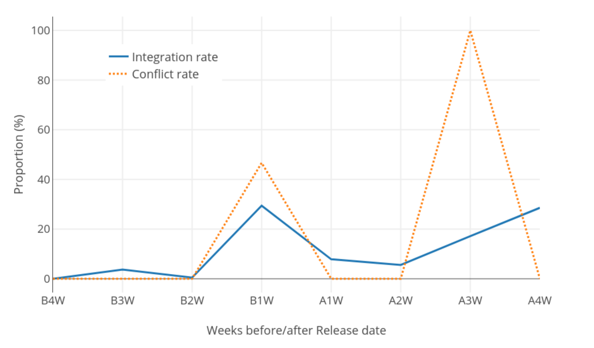
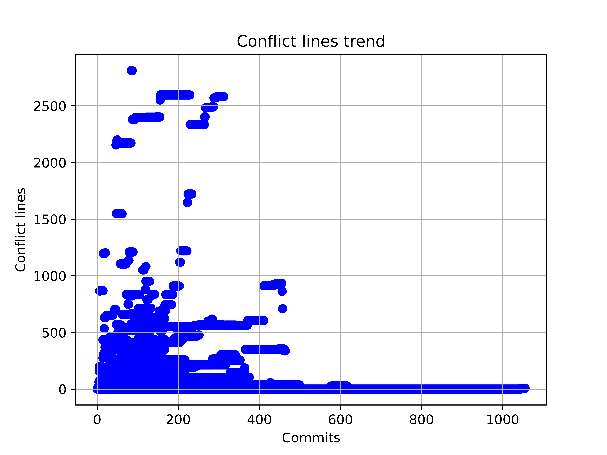
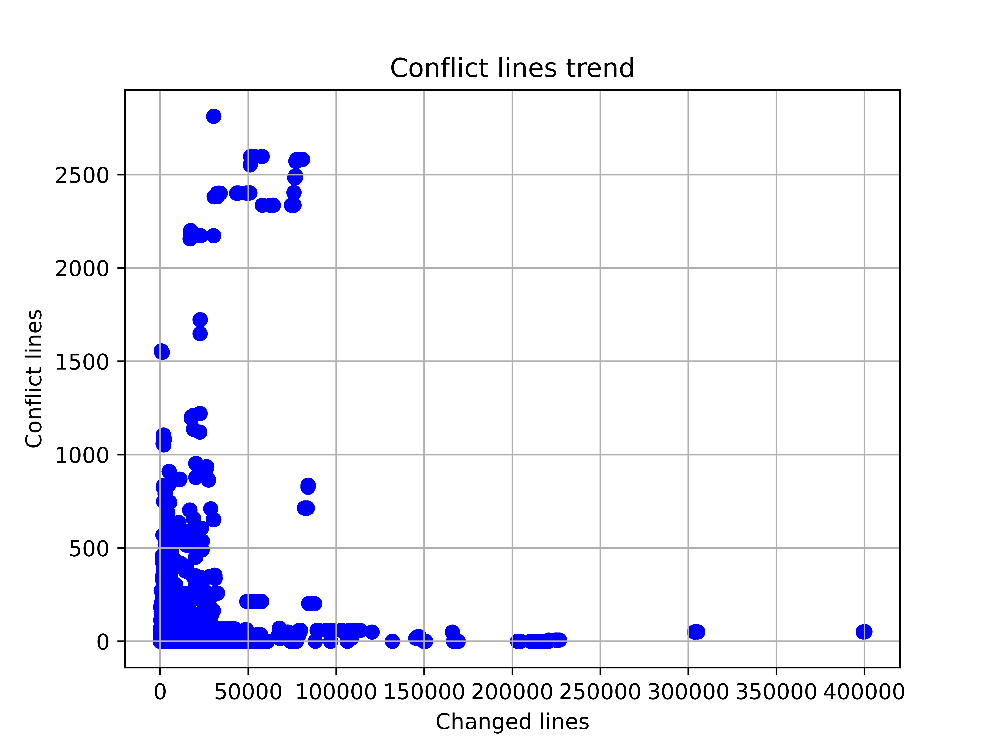
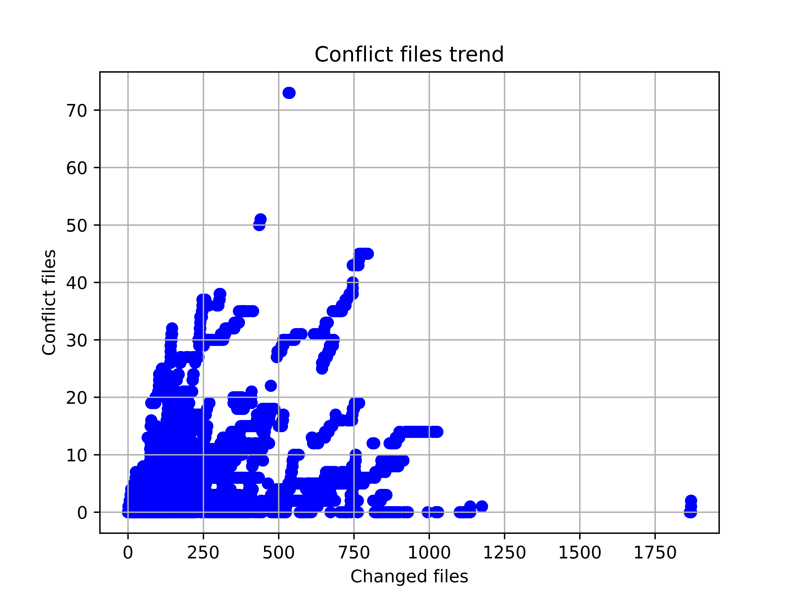
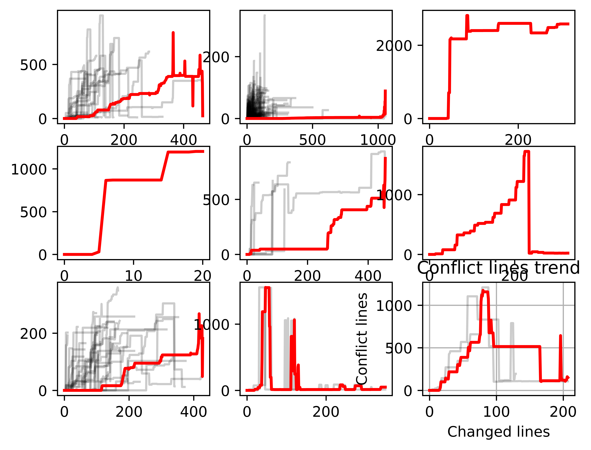

# 合入冲突风险演化分析

## 目标

本次初步探索横坐标为时间（python的`datetime`），纵坐标为两个分支上冲突的代码行数。

## 数据收集与处理

1. 选取大型软件项目，本次选取的示例项目为[Rails](https://github.com/rails/rails.git)
2. 抽取项目中的冲突提交，遍历*Rails*中的所有提交，简单的操作是检查*commit message*中是否有*conflict*类型的字符串，更加全面的操作是检查合入提交的两个*parents*合入是否会发生冲突（即是否存在*stage*非0的文件）。
3. 得到每一个冲突提交的演化历史，通过*dfs*寻找冲突提交的两个*parents*到基础提交的路径。
4. 计算每一个提交节点的冲突行数，依据时间顺序判断每个提交节点不同分支的代码状态，通过`git merge-file`得到冲突代码，计算其行数。
5. 依据冲突发生的时间和冲突行数绘图。

## 结果示例

对于每一个冲突都有对应的冲突风险演化图，列举一些典型的图

## 一些推论

> 下面的数字仅起描述性作用，并不精确

1. 大多数短期生成的冲突（10天内）仅在某一次提交中引入了少量冲突代码（30行以内），直至冲突被解决；
2. 中期生成的冲突（10-100天）会在若干次提交中不断引入冲突代码，直至冲突被解决；
3. 长期存在的冲突（>100天）可能过程中包含了其他分支冲突（**待验证**），冲突代码行数呈现先升后降的趋势。

## 疑问与方向

1. 如何分析趋势背后的影响因素？（prediction的工作涉及到一系列technical的和social的因素，如果是纯粹的预测模型，现有研究已经有很多工作了，我们的工作有何区别?
    各个冲突块之间的关联
    - Predicting merge conflicts considering social and technical assets
    - Understanding predictive factors for merge conflicts
    - Predicting merge conflicts in collaborative software development
    ）
2. 是否需要选取冲突风险趋势的更多度量，如何综合呈现这些度量？（除了冲突行数外，还有文件数、开发者数量、解决时间等，甚至可以考虑构建冲突的数量）
3. 如何为开发者合入时机提供参考？（本经验研究的出发点就是向开发者提供合入时机的定量参考，限定冲突行数阈值？限定冲突变更次数阈值？寻找冲突行数变更的拐点？与之相关的参考文献：
    - Planning for untangling: Predicting the difficulty of merge conflicts）

# 二阶段

## 摘要

先前的研究都站在冲突出现的时刻（即分支合入的时刻）研究冲突解决、冲突性质分析、冲突检测等，对于开发中冲突的累积过程探索很少，例如冲突风险增长的速度、冲突风险增长的类型。

聚焦于冲突发生前的研究主要是冲突提前检测（Proactive Detection）的工具开发或是冲突的预测，而这些工作对于冲突的累积过程没有进行深入的探索，也无法为开发者提供可解释的（make sense）的预防措施。

我们的研究选取了若干典型的开源项目，自动化地聚类、拟合这些项目中冲突风险的变化情况，并人工/自动化分析各个冲突类别的特征。

## 趋势图
### 随着时间的推移冲突行数的演化情况

横坐标为日期，观察冲突行数在每个日期上的分布

有类似结论的文章[An analysis of merge conflicts and resolutions in git-based open source projects](https://hal.science/hal-01917249/document)

区别在于该文章关注的是合入提交（release 节点）导致的冲突情况，而没有关注冲突在开发阶段不断累积的过程。

另外一种绘制方法是计算相对于分支base提交的时间，而非绝对时间，以下若干角度都是相对分支base提交而言的。

### 随着提交次数的增加冲突行数的演化情况

横坐标为分支base提交后的提交次数，观察冲突行数在每个提交上的分布。以提交次数为横坐标的序列是典型的时间序列，后续使用时间序列的分析（聚类、拟合）较为方便。

### 随着变更行数的增加冲突行数的演化情况

横坐标为分支base提交后的变更行数，观察冲突行数在对应变更行数上的分布

### 随着变更文件的增加冲突文件的演化情况

横坐标为分支base提交后的变更文件数，观察冲突文件数在对应变更文件数上的分布

## 聚类与拟合

如[前一小节](#随着提交次数的增加冲突行数的演化情况)所述，随着提交次数的增加冲突行数的演化情况可以看作时间序列，因此对于多个时间序列，采用 dtw（动态时间规整，Dynamic Time Warping） 计算这些时间序列之间的距离，然后使用kmeans进行聚类。

实现上直接调用 `tslearn` 库，取9类，最终绘制出每一类的折线。

## 问题

1. 聚类多少是合适的？
2. 是什么把各个类区分开的？（这些冲突风险相近的原因是什么、每一类的冲突特征应该如何分析）因素，现有因素相关性都不显著，因果推断也很难有显著的结果；分析方式，如何进行时间序列上的因果推断，想要的是冲突演化的特征，而不是单点的特征；开销，自动化分析硬件开销，人工分析的开销。
   - 一方面从时序角度（或演化角度）考虑，由于冲突处于软件开发的不同阶段（如集中开发、bug修复、发布），其风险程度的变化可能呈现不同趋势。
   - 另一方面从冲突性质角度考虑，对于不同的合入冲突，开发者解决之需要付出的精力不同。
3. 如何根据各个类别的特征提出建议？
