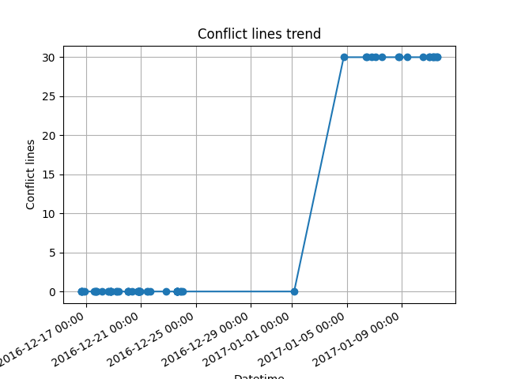
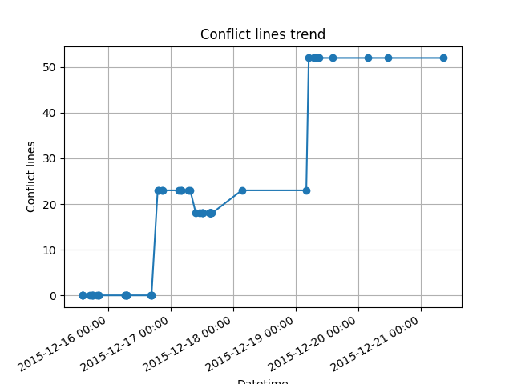
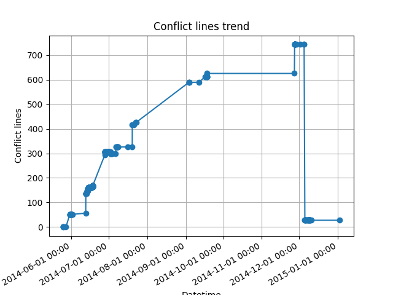
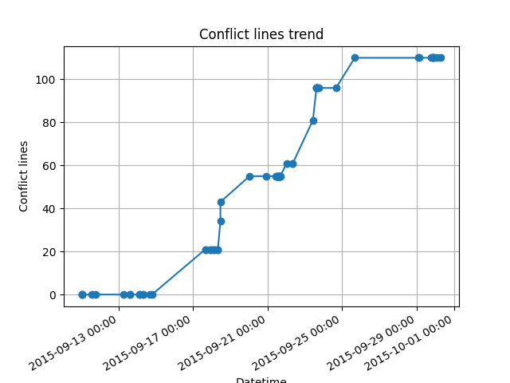

# 合入冲突风险演化分析

## 目标

本次初步探索横坐标为时间（python的`datetime`），纵坐标为两个分支上冲突的代码行数。

## 数据收集与处理

1. 选取大型软件项目，本次选取的示例项目为[Rails](https://github.com/rails/rails.git)
2. 抽取项目中的冲突提交，遍历*Rails*中的所有提交，简单的操作是检查*commit message*中是否有*conflict*类型的字符串，更加全面的操作是检查合入提交的两个*parents*合入是否会发生冲突（即是否存在*stage*非0的文件）。
3. 得到每一个冲突提交的演化历史，通过*dfs*寻找冲突提交的两个*parents*到基础提交的路径。
4. 计算每一个提交节点的冲突行数，依据时间顺序判断每个提交节点不同分支的代码状态，通过`git merge-file`得到冲突代码，计算其行数。
5. 依据冲突发生的时间和冲突行数绘图。

## 结果示例

对于每一个冲突都有对应的冲突风险演化图，列举一些典型的图

## 一些推论

> 下面的数字仅起描述性作用，并不精确

1. 大多数短期生成的冲突（10天内）仅在某一次提交中引入了少量冲突代码（30行以内），直至冲突被解决；
2. 中期生成的冲突（10-100天）会在若干次提交中不断引入冲突代码，直至冲突被解决；
3. 长期存在的冲突（>100天）可能过程中包含了其他分支冲突（**待验证**），冲突代码行数呈现先升后降的趋势。

## 疑问与方向

1. 如何分析趋势背后的影响因素？（prediction的工作涉及到一系列technical的和social的因素，如果是纯粹的预测模型，现有研究已经有很多工作了，我们的工作有何区别？
    - Predicting merge conflicts considering social and technical assets
    - Understanding predictive factors for merge conflicts
    - Predicting merge conflicts in collaborative software development
    ）
2. 是否需要选取冲突风险趋势的更多度量，如何综合呈现这些度量？（除了冲突行数外，还有文件数、开发者数量、解决时间等，甚至可以考虑构建冲突的数量）
3. 如何为开发者合入时机提供参考？（本经验研究的出发点就是向开发者提供合入时机的定量参考，限定冲突行数阈值？限定冲突变更次数阈值？寻找冲突行数变更的拐点？与之相关的参考文献：
    - Planning for untangling: Predicting the difficulty of merge conflicts）
