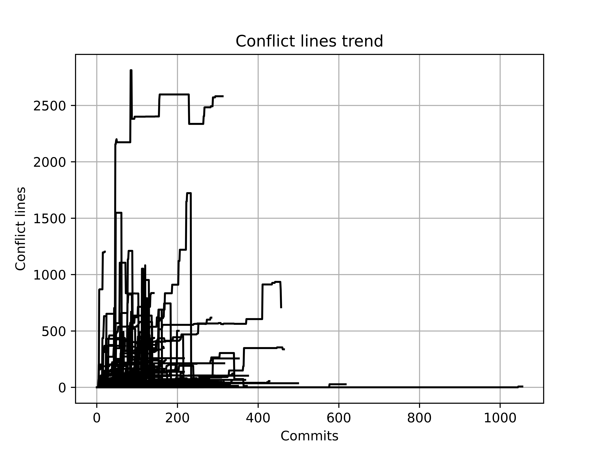
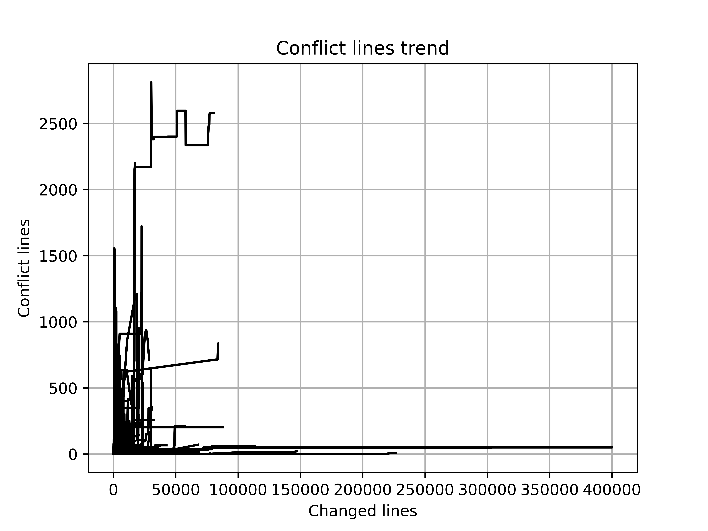
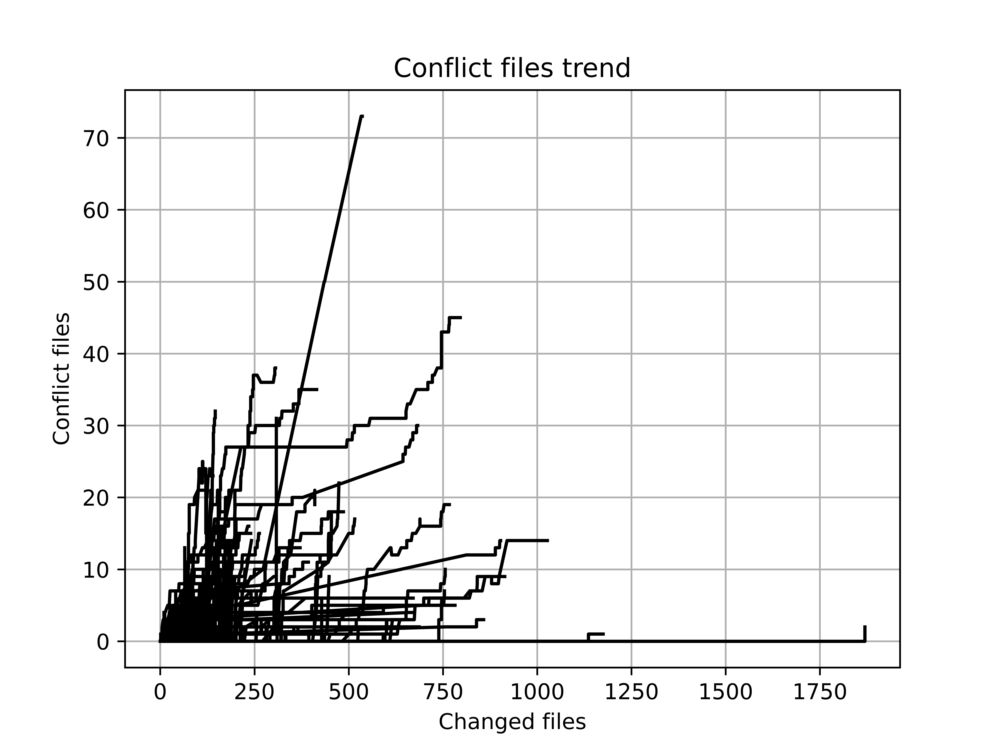

# 合入冲突风险演化分析

## 目标

本次初步探索横坐标为时间（python的`datetime`），纵坐标为两个分支上冲突的代码行数。

## 数据收集与处理

1. 选取大型软件项目，本次选取的示例项目为[Rails](https://github.com/rails/rails.git)
2. 抽取项目中的冲突提交，遍历*Rails*中的所有提交，简单的操作是检查*commit message*中是否有*conflict*类型的字符串，更加全面的操作是检查合入提交的两个*parents*合入是否会发生冲突（即是否存在*stage*非0的文件）。
3. 得到每一个冲突提交的演化历史，通过*dfs*寻找冲突提交的两个*parents*到基础提交的路径。
4. 计算每一个提交节点的冲突行数，依据时间顺序判断每个提交节点不同分支的代码状态，通过`git merge-file`得到冲突代码，计算其行数。
5. 依据冲突发生的时间和冲突行数绘图。

## 结果示例

对于每一个冲突都有对应的冲突风险演化图，列举一些典型的图

## 一些推论

> 下面的数字仅起描述性作用，并不精确

1. 大多数短期生成的冲突（10天内）仅在某一次提交中引入了少量冲突代码（30行以内），直至冲突被解决；
2. 中期生成的冲突（10-100天）会在若干次提交中不断引入冲突代码，直至冲突被解决；
3. 长期存在的冲突（>100天）可能过程中包含了其他分支冲突（**待验证**），冲突代码行数呈现先升后降的趋势。

## 疑问与方向

1. 如何分析趋势背后的影响因素？（prediction的工作涉及到一系列technical的和social的因素，如果是纯粹的预测模型，现有研究已经有很多工作了，我们的工作有何区别?
    各个冲突块之间的关联
    - Predicting merge conflicts considering social and technical assets
    - Understanding predictive factors for merge conflicts
    - Predicting merge conflicts in collaborative software development
    ）
2. 是否需要选取冲突风险趋势的更多度量，如何综合呈现这些度量？（除了冲突行数外，还有文件数、开发者数量、解决时间等，甚至可以考虑构建冲突的数量）
3. 如何为开发者合入时机提供参考？（本经验研究的出发点就是向开发者提供合入时机的定量参考，限定冲突行数阈值？限定冲突变更次数阈值？寻找冲突行数变更的拐点？与之相关的参考文献：
    - Planning for untangling: Predicting the difficulty of merge conflicts）

# 二阶段

- 推荐？ 权衡冲突累积趋势和冲突修复难度
- 预测？ 模型选取
- 规律？ 因素选取

如果将所有的趋势点一股脑绘制在一幅图中很有可能无法看出任何趋势（或者拟合出任何曲线），因此合入冲突风险规律的探索需要对不同的冲突依据不同的因素维度进行合理的分类。

一方面从时序角度（或演化角度）考虑，由于冲突处于软件开发的不同阶段（如集中开发、bug修复、发布），其风险程度的变化可能呈现不同趋势。

另一方面从冲突性质角度考虑，对于不同的合入冲突，开发者解决之需要付出的精力不同。

## 随着时间的推移冲突行数的演化情况

横坐标为日期，观察冲突行数在每个日期上的分布

有类似结论的文章[An analysis of merge conflicts and resolutions in git-based open source projects](https://hal.science/hal-01917249/document)

区别在于该文章关注的是合入提交（release 节点）导致的冲突情况，而没有关注冲突在开发阶段不断累积的过程。

另外一种绘制方法是计算相对于分支base提交的时间，而非绝对时间，以下若干角度都是相对分支base提交而言的。

## 随着提交次数的增加冲突行数的演化情况

横坐标为分支base提交后的提交次数，观察冲突行数在每个提交上的分布

## 随着变更行数的增加冲突行数的演化情况

横坐标为分支base提交后的变更行数，观察冲突行数在对应变更行数上的分布

## 随着变更文件的增加冲突文件的演化情况

横坐标为分支base提交后的变更文件数，观察冲突文件数在对应变更文件数上的分布

